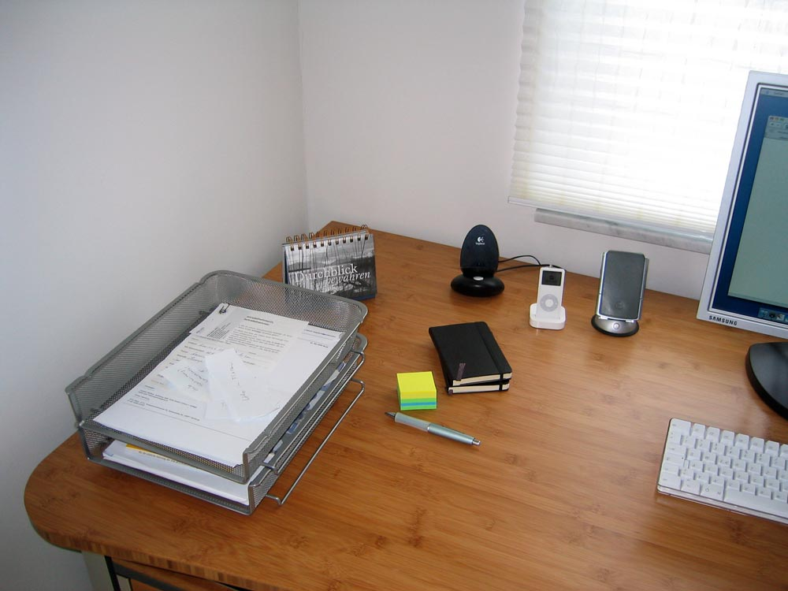

## One and a Half Years With GTD

Since exactly one and a half years I use now the principles of _GTD_ (<em>Getting Things Done</em>®), from the book by _David Allen_ to organize my daily tasks.

In his book _<AffiliateLink asin="0143126563">Getting Things Done: The Art of Stress-Free Productivity</AffiliateLink>_, David Allen introduces an interesting system that allows you to do your daily tasks effectively and efficiently.

<Row variant="variable" marginBottom>
  <AmazonBook asin="0143126563" />
</Row>

In any case, I think that one _gets_ the everyday madness governed by Allen’s system.

## The GTD Basics

GTD uses so-called _contexts_, which are certain situations/places to which a task is assigned (telephone, home, care or similar). Besides, there can be an allocation to a _project_.

Tasks are done within your context, which means you do several calls at once if you’re already on the phone.

In GTD everything that comes as _stuff_ on the table, is moved to an Inbox. This _stuff_ can be varied and consist of e-mails, mail, voice memos, notes, scribbles, etc. The Inbox will be emptied at some point in time (for example, Friday afternoon) with each task being processed, leaving nothing unprocessed in the Inbox.

Depending on the estimated effort, the tasks are either completed immediately (if the duration is of about 2 minutes) or moved to another location. If the task is part of a multi-part process, a project is created to which the task is assigned.

_Stuff_ can also be removed as reference material for later (like a brochure).

If a task is not done for the time being, because you have no time or no active interest in it - but you think it is so interesting that you do not want to destroy it right away, you move it to a list of things to do _Someday / Maybe_. This list can be reviewed now and then. Thus, the ideas are not lost, but also do not burden the head.

Tasks can also be delegated or assigned to certain times. If you have to wait for someone else to do a task, you assign it to the context of _Waiting for_.

## GTD in Everyday Life

At first glance, GTD may look complicated or awkward, but it helps immensely to keep the head off pondering.

After a short time of adjustment, I got used to this way of working and quickly took over the property to write down every thought **immediately** and according to the GTD principle somewhere to classify. So I never forget important things again and even small ideas do not immediately disappear from the head.

Ideally, you have certain **work tools** that can vary depending on the person and circumstances. I use a combination of web application, text files, [Moleskine®](http://moleskine.com) notebook and post-its® in different places (on the bedside table).

Especially for computer professionals, some numerous systems and programs allow GTD digital. Thus, the right work tool should probably be found for everyone. Whole sites and weblogs only deal with GTD (for example [lifehack.org](https://www.lifehack.org/), [lifehacker](https://lifehacker.com/) or [43 Folders](http://www.43folders.com/)).

## The Right GTD Solution?

Since I met GTD for the first time, I’m looking for and testing alternative solutions for Allen’s system (albeit less frequently).

Right away: The perfect system in the daily implementation doesn’t exist for me, with **all** solutions you have to compromise. Only when a neural interface has been developed, in which one can feed his thoughts immediately in text form and can retrieve directly and anywhere on the retina, I am probably satisfied.

Most of the solutions I’ve seen so far have been either too simple or too complex for me.

Too simple systems did not work for me - such as pure text. Certain things always remained outside. I’ve been testing an interesting candidate with [TaskPaper](http://www.hogbaysoftware.com/products/taskpaper) over the last few weeks, which unfortunately did not allow me to schedule appointments and therefore was not sufficient in the long-term test. Let's see how the software evolves.

To **complex systems**, which allowed various lists, keywords, various data and mappings, were too time-consuming in my daily use.

Key features for me are:

1. **Location independence**, - since I am an employee, I want to capture my thoughts from different places.
2. **System independence** - Not so important anymore, but I do not want to depend on certain operating systems.
3. Assign **Appointments** - For me a separation in a diary and _Next Actions_ is out of the question.
4. **Fast and easy** - It has to be easy, ideally without a mouse or just a few clicks.

At the same time, I've occasionally gone double-tracked to test a new system, but I still use my primary tool.

## Update

After it’s release in 2009 I started using [Things](https://culturedcode.com/things/) by Cultured Code. After using it for a few years updates became scarce and the next version was late for a _few_ years. I tried in the meantime a few different solutions but a few months after the release of **Things 3** I switched back, because of it’s easy to use interface and instant synchronization speed.
