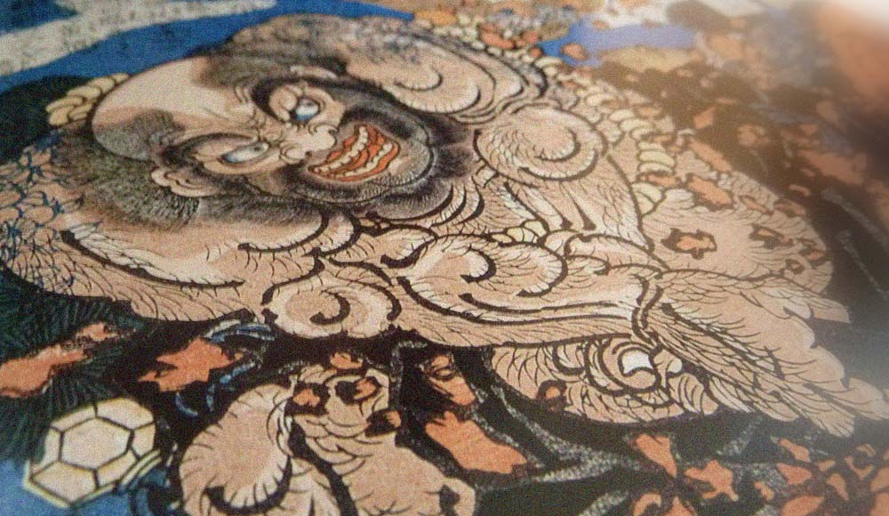

## Inspiration and Idea For My Header

The idea for the design of <del>this new website</del> <ins>a previous version of this website</ins> has been buzzing around in my head for some time. But somehow she did not want to move into the physical world. As an inspiration, I used the art of Japanese tattoo – Irezumi.

## Irezumi – The Japanese Tattoo

Tattoos are an art that is transient in the truest sense of the word since with the wearer the artwork also disappears as soon as he dies. But this fits in well with the concept of the _flowing world_, a concept of transience in Buddhism. In the symbol of the samurai, the cherry blossom, one can also see the transience of being after a short duration of a perfect life.

These works of art are extremely painful (dozens of bamboo needles are [stung several times a second](https://www.youtube.com/watch?v=NddXHY2QUV0)), tedious (from a few months to several years) and expensive (starting at 20,000 €). That is also the reason why I like to look at them, but definitely never will wear one myself.

One of the best living artists of the Irezumi is Horiyoshi III, whose works can be seen in some illustrated books: <AffiliateLink asin="9074822452">Tattoos from the Floating World: Ukiyo-e Motif's in Japanese Tattoo</AffiliateLink> and <AffiliateLink asin="0764312014">Bushido: Legacies of the Japanese Tattoo</AffiliateLink>.

<Row variant="variable" marginBottom minWidth="130px">
  <AmazonBook asin="9074822452" />
  <AmazonBook asin="0764312014" />
</Row>

Irezumi does not at random tattoo any things on the body, the images have a deep meaning to the wearer and require expertise on religion, history, and myths from China and Japan. That is also the reason why bad copies and pseudo-Japanese tattoos are often offered in Western tattoo studios. These tattooists usually lack this background knowledge.

## Yakuza

Most famous is the tattoo by their most significant carriers – the members of the Japanese criminal organization [Yakuza](https://en.wikipedia.org/wiki/Yakuza) – but today Irezumi is also known by businessmen and even Housewives worn.

The links to the Japanese art of [ukiyo-e](https://en.wikipedia.org/wiki/Ukiyo-e) (woodcut) are fluid and the motives are often the same.

## Motives

In addition to gods, mythical creatures and demons, the most important source of motifs is the ancient Chinese novella _[Shuǐhǔ Zhuàn](https://en.wikipedia.org/wiki/Water_Margin)_ (Water Margin), known in Japan as _Suikoden_. It belongs to one of the four classical books of Chinese literature. The German translation of this very entertaining book is called _<AffiliateLink asin="3458318917">Die Räuber vom Liang Schan Moor</AffiliateLink>_.

## Water Margin

In short, it is about a band of robbers of 108 heroic men and women, each of whom is forced into lawless life by adverse circumstances, and entrenching themselves on a fortified island in Liang-Shan marsh, where they go on a rampant raid for years. They fight against corrupt officials of the emperor and numerous villains. The story is true in parts and should have taken place in the Song Dynasty.

The adventure is available in paperback format and very entertaining – even for children – although one or the other side is perhaps a little bit more evil and cruel than the regular children's book.

## Meaning of the Motif

The motif I chose for my design shows a koi (carp) trying to swim up the heavy rapids of Longmen Falls.

Legend has it that a koi, who manages to swim up the magical waterfalls, transforms into a dragon. After another 500 years, he turns into a horned dragon and after 1000 years into a winged dragon. Thus, the next design should probably show a dragon.

The hardest part of my design was how much tattooing to see on the page. While the real Japanese tattoo lives on the surface, leaving nothing to feet, hands and a small front area, such a large area would have made the page too restless and too distracted from the content. To make matters worse, there is actually no real end to such work. But on the internet you’re space is limited by the edges of the browser.

Nevertheless, I hope that I have managed to capture the appearance of an Irezumi digitally.
