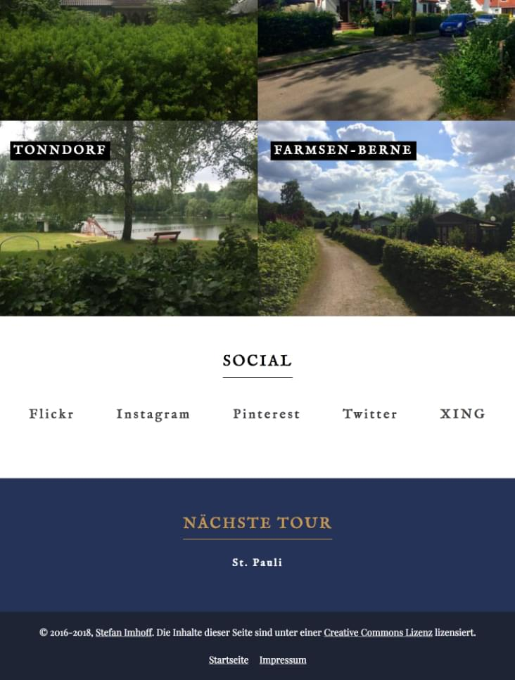

<Row variant="bigLeft" marginBottom>

I created a [website](https://hamburg.stefanimhoff.de/) for one of my hobbies: I explore Hamburg, mostly walking, sometimes biking to find out more about the individual districts and to shoot photos. There are 109 districts in Hamburg and I plan to walk them all, street by street.

The website is mostly a **photography** blog, but I also write **short essays** about the districts. The website is written in English, so visitors from around the world can find out places to visit while staying in Hamburg.

</Row>

<Row variant="fullsize" marginBottom>

## Color Palette

</Row>

<Row variant="variable" minWidth="12rem" repeat="auto-fill" marginBottom>

<ColorSwatch color="#000000" />
<ColorSwatch color="#1E2433" />
<ColorSwatch color="#253358" />
<ColorSwatch color="#42413F" />
<ColorSwatch color="#C19755" />
<ColorSwatch color="#FFFFFF" />

</Row>

---

<Row variant="variable" horizontal="center" maxWidth="50vw" marginBottom>

</Row>

---

<Row variant="center" marginBottom>

## Homepage

</Row>

<Row variant="center" marginBottom>

</Row>

<Row variant="center" marginBottom>

## Tablet & Phone

</Row>

<Row variant="variable" marginBottom>

</Row>

<Row variant="variable">

</Row>
