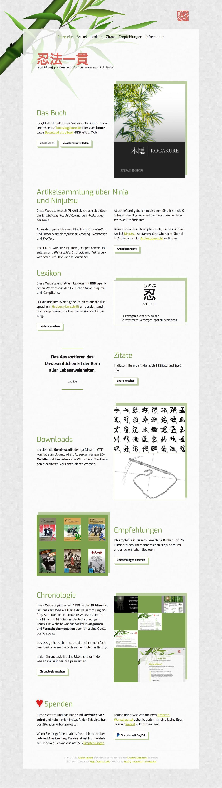
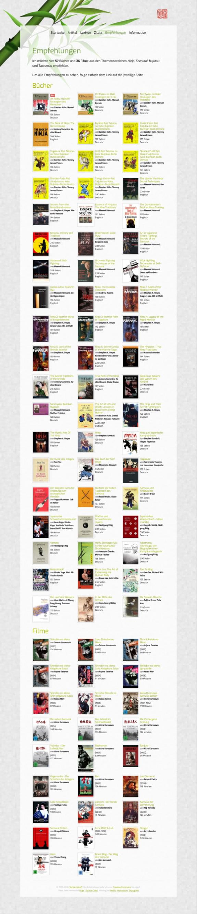
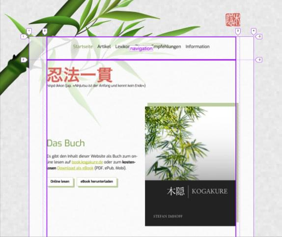
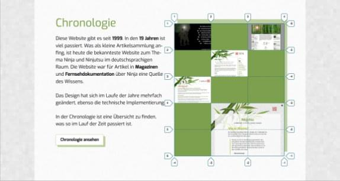
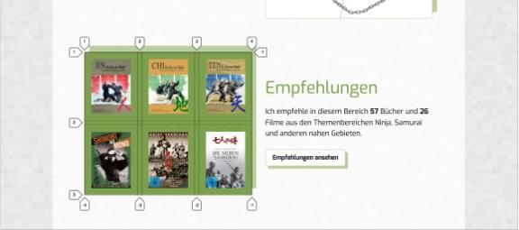

<Row variant="bigLeft" marginBottom>

I redesigned my **Martial Arts Online Magazine** in 2017. Additionally I moved the website from _Jekyll_ (as static page generator) to [Hugo](http://gohugo.io/). I used **CSS Grid Layout** throughout the website, the homepage has **12 different grids**.

I removed clutter by removing some background patterns, added new hover animations for images and container, added new buttons and a new pulsing heart animation for the donation section.

I added **Service Worker** and full offline support for the website. The source programming is available on [GitHub](https://github.com/kogakure/website-hugo-kogakure.de).

</Row>

<Row variant="fullsize" marginBottom>

## Color Palette

</Row>

<Row variant="variable" minWidth="10rem" marginBottom>

<ColorSwatch color="#1A171B" />
<ColorSwatch color="#B0BC04" />
<ColorSwatch color="#7CA04D" />
<ColorSwatch color="#BCCE9F" />
<ColorSwatch color="#DDDDDD" />
<ColorSwatch color="#FFFFFF" />

</Row>

---

<Row variant="center" marginBottom>

</Row>

---

<Row variant="center" marginBottom>

</Row>

---

<Row variant="center" marginBottom>

</Row>

<Row variant="center" marginBottom>

## Homepage

</Row>

<Row variant="center" marginBottom>

</Row>

<Row variant="center" marginBottom>

## Subpages

</Row>

<Row variant="equal" marginBottom>

</Row>

<Row variant="center" marginBottom>

## Grid Layout

</Row>

<Row variant="equal">

</Row>

<Row variant="equal" marginBottom>

</Row>

<Row variant="center" marginBottom>

## Tablet & Phone

</Row>

<Row variant="equal" vertical="end">

</Row>
