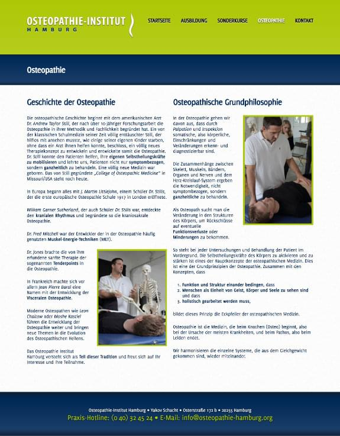

<Row variant="bigLeft" marginBottom>

This website for the **Osteopathie-Insitut Hamburg**, a school to learn Osteopathie was one of the last websites I created before I started working as a _Frontend Engineer_ for [XING](https://www.xing.com/) on just one product.

I invested full effort into it not only because the teacher of that school was my Martial Arts teacher at that time, but also because the provided material (photos, quotes, text) was fantastic.

The website had an interactive carousel on the homepage, collapsible sections in the course section, a custom Google Map pin and a contact form.

</Row>

<Row variant="fullsize" marginBottom>

## Color Palette

</Row>

<Row variant="variable" minWidth="8rem" marginBottom>

<ColorSwatch color="#002856" />
<ColorSwatch color="#E5E9EE" />
<ColorSwatch color="#AEC605" />
<ColorSwatch color="#BED137" />
<ColorSwatch color="#CDDD68" />
<ColorSwatch color="#DEE99B" />
<ColorSwatch color="#FFFFFF" />

</Row>

---

<Row variant="center" vertical="center" marginBottom>

</Row>

---

<Row variant="center" marginBottom>

## Homepage

</Row>

<Row variant="center" marginBottom>

</Row>

<Row variant="center" marginBottom>

## Training Page

</Row>

<Row variant="center" marginBottom>

</Row>

<Row variant="center" marginBottom>

## Subpages

</Row>

<Row variant="rightDown">

</Row>

<Row variant="center" marginBottom>

## Contact

</Row>

<Row variant="center" marginBottom>

</Row>
