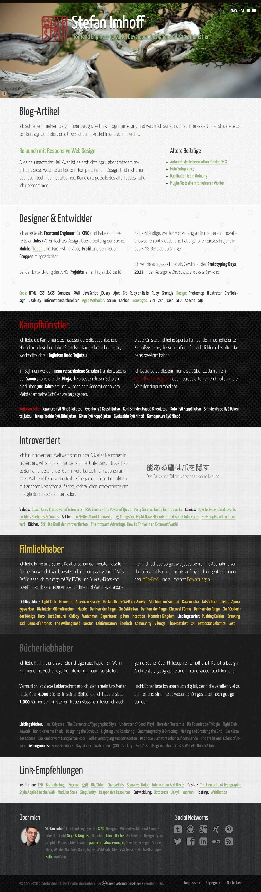

<Row variant="bigLeft" marginBottom>

My **website** and **blog** relaunched in _April 2014_ with a **Responsive Design**.

I build it with [Jekyll](http://jekyllrb.com/), later migrated to [Hugo](https://gohugo.io/), and automated the process with [Gulp.js](http://gulpjs.com/), optimized for various screen resolutions starting at a smartwatch up to desktop size. It uses SVG for the logo and all icons. It is speed optimized and passes Googles Page Speed Insights Test with full score. I provide a full Styleguide to see all variations possible for content elements. The source programming is available on [GitHub](https://github.com/kogakure/stefanimhoff.de-jekyll/).

The fantastic Bonsai image was shot by _Norio Nakayama_ and provided with a CC license on [Flickr](https://www.flickr.com/photos/norio-nakayama/9156103138).

</Row>

<Row variant="fullsize" marginBottom>

## Color Palette

</Row>

<Row variant="variable" minWidth="10rem" repeat="auto-fill" marginBottom>

<ColorSwatch color="#333333" />
<ColorSwatch color="#89B46B" />
<ColorSwatch color="#B42B2C" />
<ColorSwatch color="#FFFFFF" />

</Row>

---

<Row variant="center" vertical="center" marginBottom>

</Row>

---

<Row variant="center" vertical="center" marginBottom>

</Row>

---

<Row variant="center" marginBottom>

## Homepage

</Row>

<Row variant="center" marginBottom>

</Row>

<Row variant="center" marginBottom>

## Subpage

</Row>

<Row variant="center" marginBottom>

</Row>

<Row variant="center" marginBottom>

## Phone

</Row>

<Row variant="equal" marginBottom>

</Row>

<Row variant="equal" marginBottom>

</Row>

<Row variant="equal" marginBottom>

</Row>

<Row variant="equal" vertical="center">

### Offscreen Navigation

</Row>
