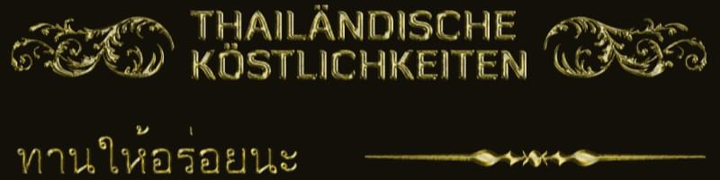
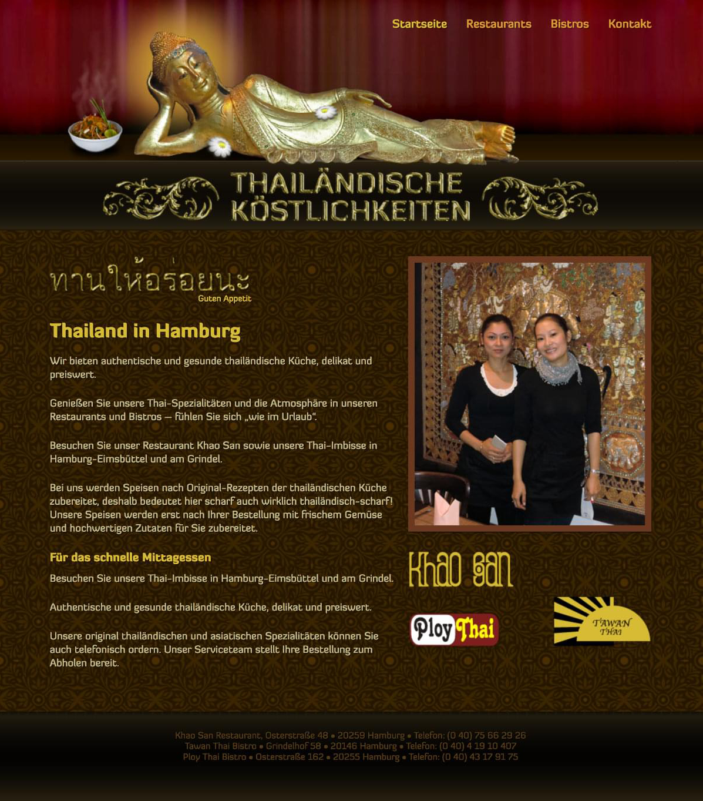
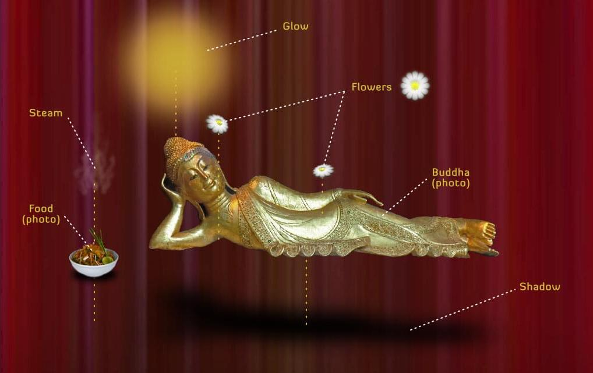
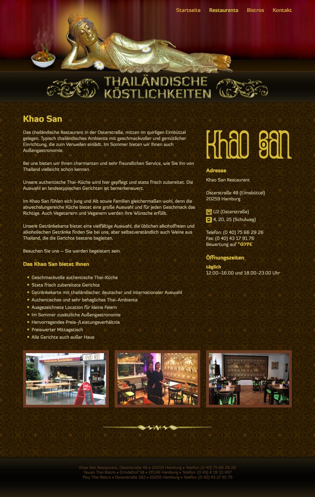
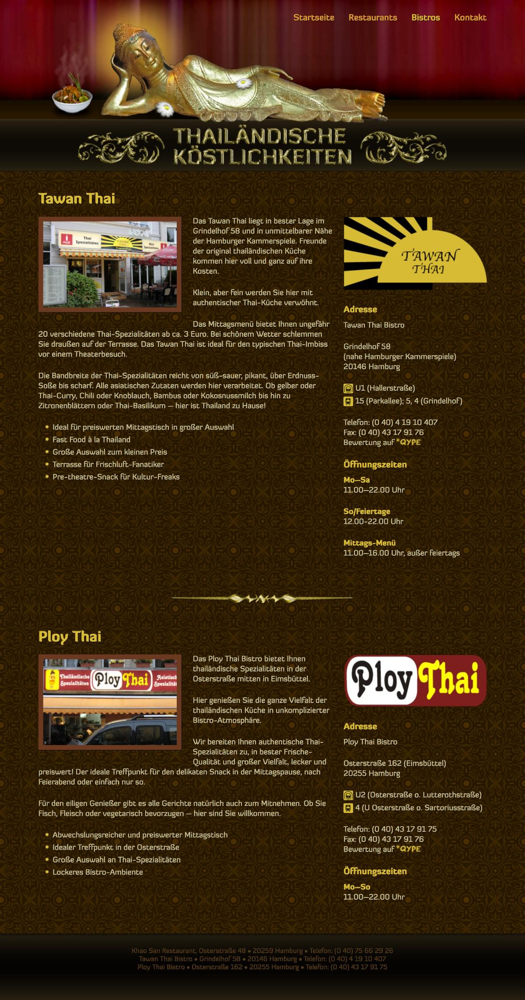

<Row variant="bigLeft" marginBottom>

I created this small website for three Thai restaurants in Hamburg in 2010. Of the more than **100** websites I created in my career, this one I still remember. It stayed online for nearly **10 years**.

I learned a lot about Graphic Design while working on it. I created the complete graphic by myself and learned how to design Gold items. I wanted to stay as true to Thai culture as possible and researched in-depth the colors and style of Thailand.

</Row>

<Row variant="fullsize" marginBottom>

## Color Palette

</Row>

<Row variant="variable" minWidth="10rem" repeat="auto-fit" marginBottom>

<ColorSwatch color="#241701" />
<ColorSwatch color="#4B2E01" />
<ColorSwatch color="#6B3920" />
<ColorSwatch color="#D8BB34" />
<ColorSwatch color="#C2BC8D" />

</Row>

---

<Row variant="variable" horizontal="center" maxWidth="50vw" marginBottom>

</Row>

<Row variant="center" vertical="center" marginBottom>

</Row>

<Row variant="center" marginBottom>

## Homepage

</Row>

<Row variant="center" marginBottom>

</Row>

<Row variant="center" marginBottom>

## Making-Of Buddha Composition

</Row>

<Row variant="center" marginBottom>

</Row>

<Row variant="center" marginBottom>

## Subpages

</Row>

<Row variant="rightDown">

</Row>
