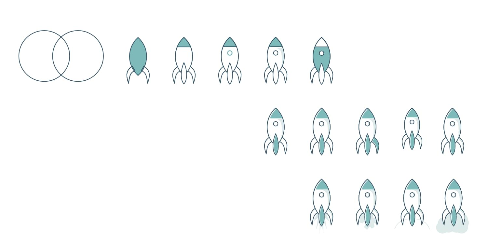
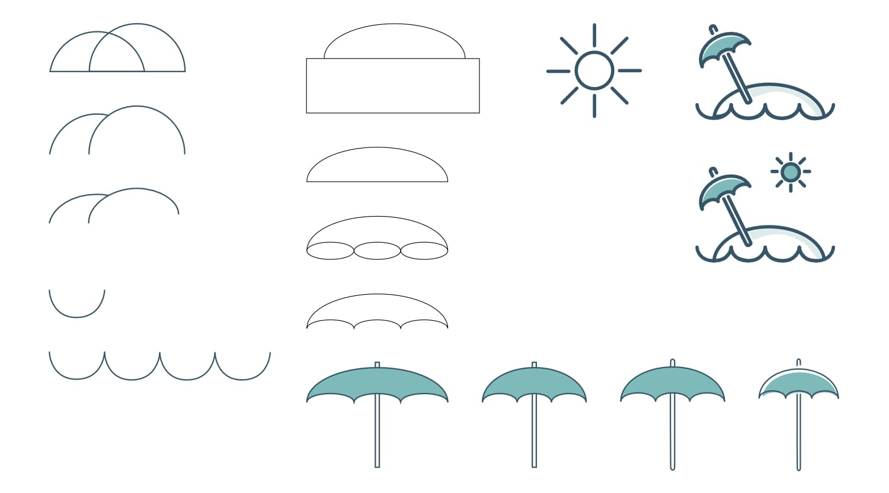

<Row variant="bigLeft" marginBottom>

I was asked to create three new illustrations that could be used for an Onboarding screen on [XING](https://www.xing.com/). The screen was intended to let users choose their current working status.

One icon was needed for _Job Beginners_, one for _Professionals_ and one for _Retired People_. One of the objectives was to make sure the icons fit into the **XING illustration brand style guide**.

</Row>

---

<Row variant="center" marginBottom>

## Final Illustrations

</Row>

<Row variant="center" marginBottom>

</Row>

<Row variant="center" marginBottom>

## Final Draft

</Row>

<Row variant="center" vertical="center" marginBottom>

</Row>

<Row variant="center" marginBottom>

## Making-Of

</Row>

<Row variant="center" vertical="center" marginBottom>

</Row>
