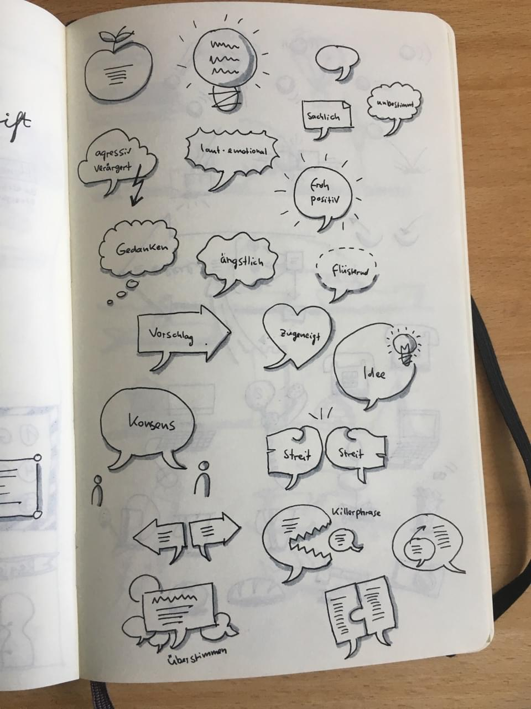
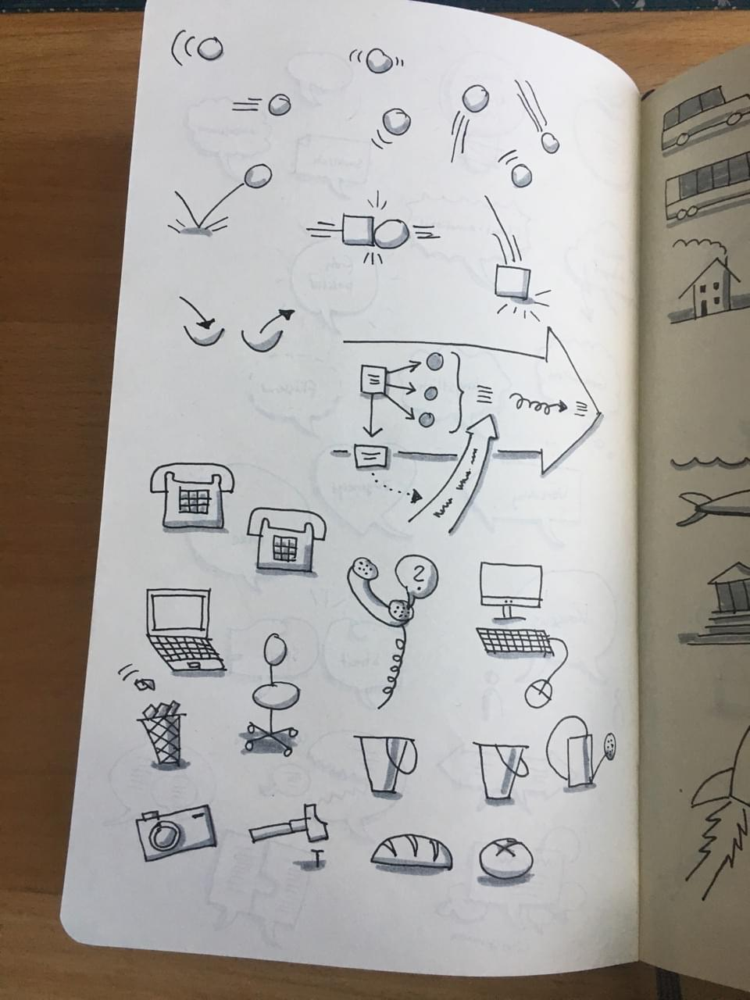
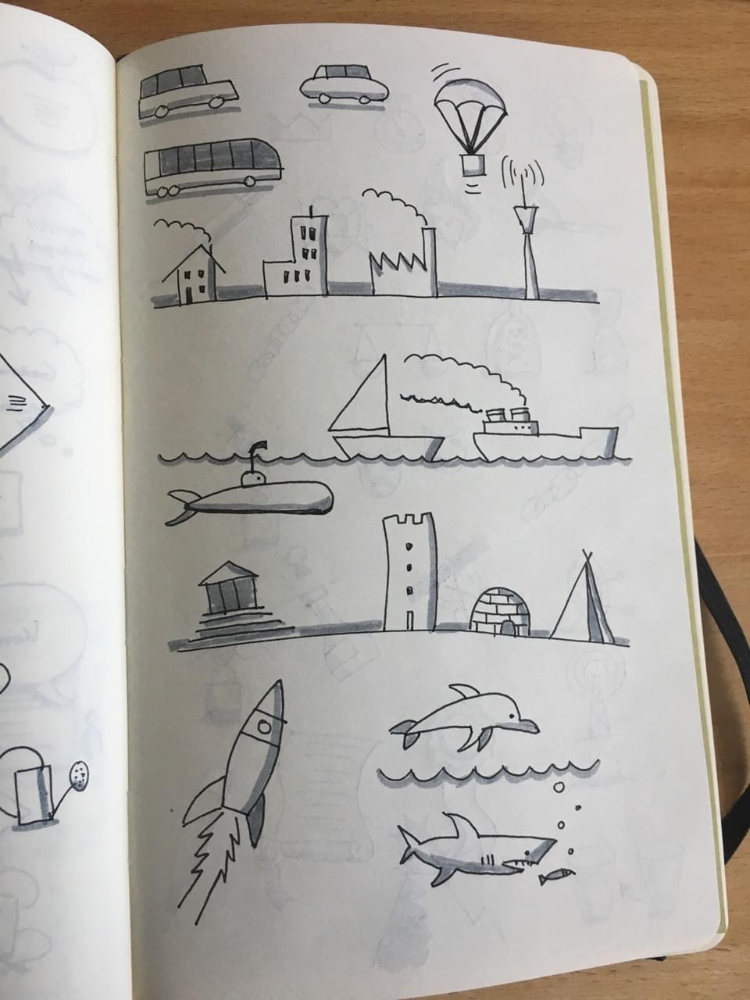
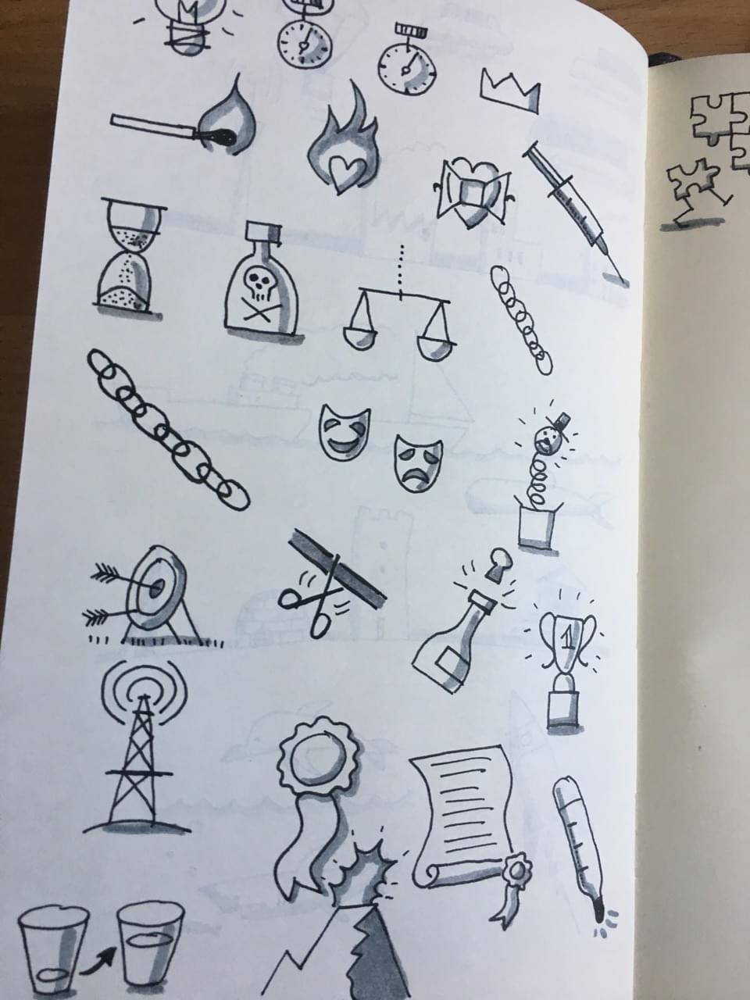
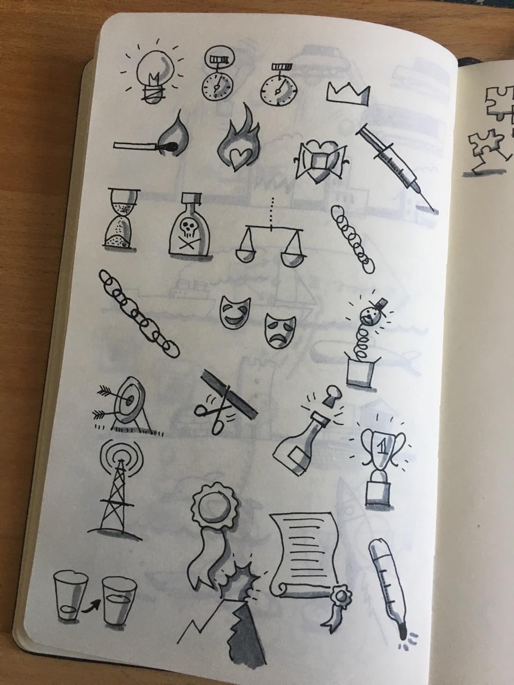

Practicing containers and lettering in my practice sketchbook. Vocabulary from the [bikablo® books](https://bikablo.com/). Highlighting and shadows are done with the fantastic [fineOne brush pen](https://de.neuland.com/marker-stifte/neuland-marker/neuland-fineone-art-pinselspitze-0-5-5-mm-einzelfarben.html?c=725).

