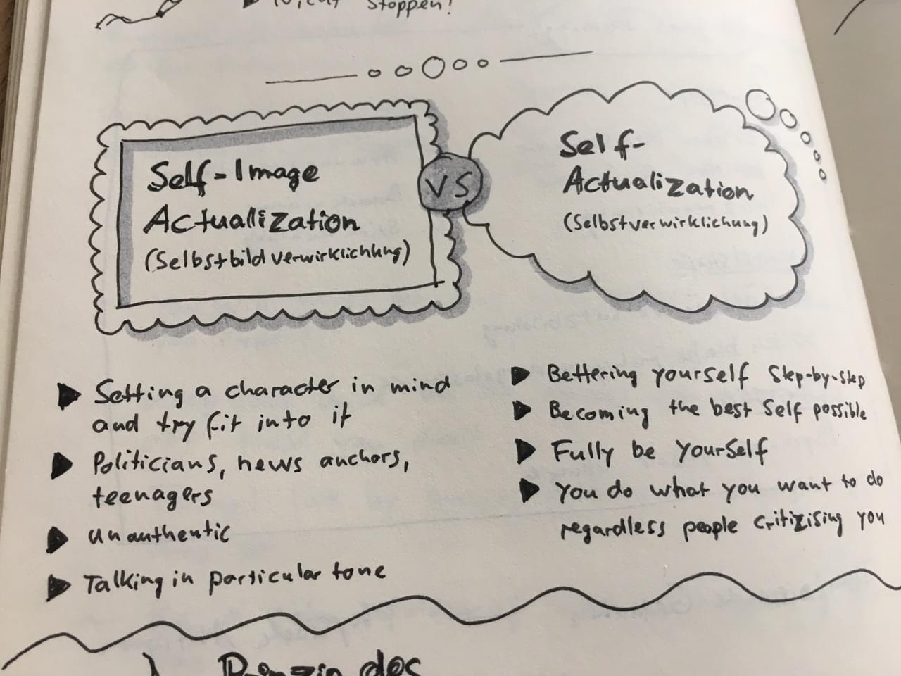

**Bruce Lee** on the difference between **Self-Actualization** (dt. Selbstbildverwirklichung) and **Self-Image Actualization** (dt. Selbstverwirklichung). Most people only pursue the first and never find their true selves.

More on the topic in this article on _Brain Pickings_: [Bruce Lee on Self-Actualization and the Crucial Difference Between Pride and Self-Esteem](https://www.brainpickings.org/2015/12/18/bruce-lee-artist-of-life-self-esteem/).

<Blockquote author="Bruce Lee">

Many people dedicate their lives to actualizing a concept of what they should be like, rather than actualizing themselves.

This difference between self-actualization and self-image actualization is very important. Most people live only for their image.

</Blockquote>
