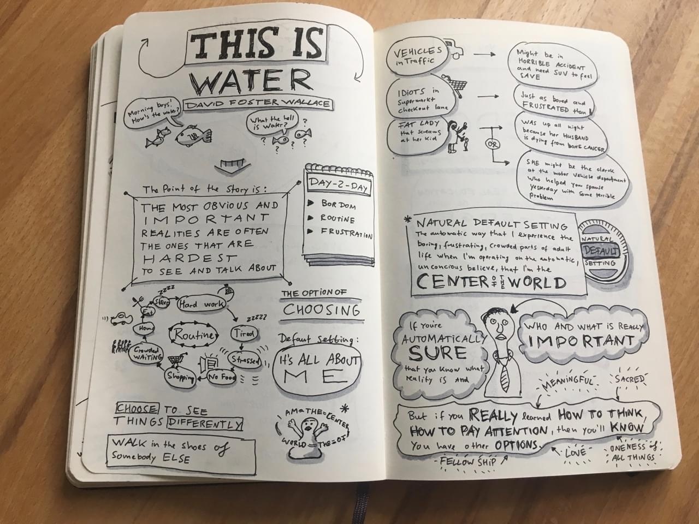

I always wanted to do a Sketchnote for the Commencement Speech **This Is Water** to Kenyon College class of 2005 by the late **David Foster Wallace**. It was always one of my favorite philosophical speeches about freedom of choice.

The Sketchnote is based on the short film by _The Glossary_, who made a fantastic piece of art out of his speech.

<Blockquote author="Charles Duhigg" source="The Power of Habit: Why We Do What We Do and How to Change" sourceURL="https://www.goodreads.com/book/show/17248798-the-power-of-habit">

The water is habits, the unthinking choices and invisible decisions that surround us every day – and which, just by looking at them, become visible again.

</Blockquote>
